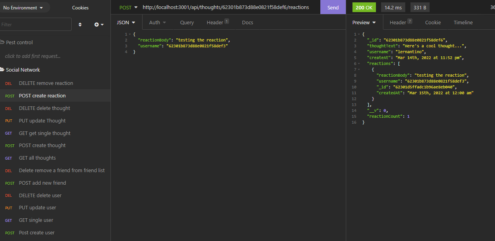

 

# Unit 18: Social Network API

## [Description](#description)

In this homework, I created an API for a social web application where users can share their thoughts, react to friends's thoughts, and create a friend list. I used mogoose models to sync to the MongoDB database. For this homework, we do not have a front end, so I used insomnia to test the routes to create users and thoughts. Some of the routes I created are the update, delete and get one user. add or delete friends from each user friend list. Create, delete and update thoughts, create and delete reactions and get all thoughts or all users. 

### Link to application:
Here is a screencapture video demostrating the functionality of the [application](https://watch.screencastify.com/v/sgoaidVgaX7dCY310cgG). If this link does not work, you can try [this one](https://drive.google.com/file/d/1z4bSsPsEH7L66j2KOExLFEa0-1ExykA5/view).

## Table of Content

* [Description](#description)
* [Installation](#installation)
* [Test](#test)
* [Usage](#usage)
* [License](#license)
* [Contributing](#contributing)
* [Questions](#questions)

## [Installation](#installation)
To initialie, run the following command.

    npm start,

## [Test](#test)
To run tests, run the following command

    no test available at this moment

## [Usage](#usage)

This application is a Soial Network API, for users to react to other users thoughts and create a friend list.

### Screenshot of Insomnia displaying the results of some routes:

## [License](#license)

## [Contributing](#contributing)

none

## [Questions](#questions)

If you have any questions about the repo, or would like to contact me directly, 
here is my email: maribel.montes4@gmail.com. You can find more of my work at [Maribel Montes](https://github.com/MaryMD98).

